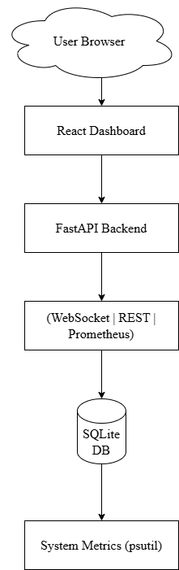

# 🚀 AutoOps Monitoring Dashboard

AutoOps is a real-time AIOps-inspired monitoring system that tracks system performance, detects anomalies, and performs automated healing actions.

---

## 🧠 Key Features

- 📊 Real-time CPU, Memory, Disk monitoring
- 🔄 Live updates using WebSockets
- ⚠️ AI-based anomaly detection (statistical model)
- 🛠️ Auto-healing system for high CPU usage
- 🗄️ Historical metrics stored in database
- 📈 Historical trend visualization (charts)
- 🌐 Multi-server monitoring support
- 📡 Prometheus metrics endpoint

---

## 🏗️ Architecture

User Browser
      |
React Dashboard
      |
FastAPI Backend
      |
(WebSocket | REST | Prometheus)
      |
SQLite DB
      |git init
System Metrics (psutil)

---

## ⚙️ Tech Stack

### Frontend

- React (Vite)
- Recharts
- CSS

### Backend

- FastAPI
- WebSockets
- SQLAlchemy
- SQLite

### Monitoring

- Prometheus

---

## 🔄 How It Works

1. System metrics are collected using `psutil`
2. Metrics are streamed via WebSocket
3. Backend detects anomalies using statistical logic
4. Alerts are generated for abnormal behavior
5. Auto-healing actions trigger for high CPU usage
6. Data is stored for historical analysis
7. Frontend visualizes real-time + historical trends

---

## 📊 API Endpoints

| Endpoint               | Description                             |
|----------------------|-----------------------------------------|
| `/metrics`           | Get current system metrics              |
| `/history`           | Get historical data                     |
| `/servers`           | List available servers                  |
| `/server/{name}`     | Get metrics for specific server         |
| `/ws`                | WebSocket for real-time updates         |
| `/prometheus-metrics`| Prometheus monitoring                   |

---

## 🚀 How to Run

### Backend

```bash
cd autoops
uvicorn server:app --reload
```

### Frontend

```bash
cd autoops-dashboard
npm install
npm run dev
```

---

## 🏗️ Architecture Diagram



---

## 🎯 Future Enhancements

- LLM-based root cause analysis
- Kubernetes integration
- Cloud deployment (AWS/GCP)
- Advanced anomaly detection (ML models)

---

## 👨‍💻 Author

Rishi — Full Stack Developer (AI + Cloud + Systems)